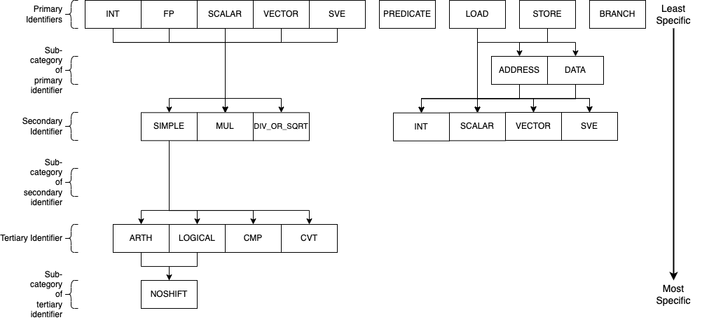

AArch64
=======

SimEng provides an implementation of the 64-bit AArch64 architecture, specifically the Armv9.2-a ISA. This implementation provides support for decoding and executing a range of common instructions, sufficient to run a number of simple benchmarks. It is also capable of handling supervisor call (syscall) exceptions via basic system call emulation, allowing the execution of programs that have been statically compiled with the standard library.

.. contents:: Contents

Decoding
--------

Instruction decoding is performed using the `Capstone <https://github.com/aquynh/capstone/>`_ disassembly framework. The disassembly generated by Capstone is used to determine the properties, operands, and execution behaviour of the corresponding instruction.

The logic held in ``src/lib/arch/aarch64/Instruction_decode.cc`` is primarily associated with converting the provided Capstone instruction metadata into the appropriate SimEng ``instruction`` format. Additionally, an instruction's identifiers are defined here through operand usage and opcode values. For the AArch64 architecture model, the following identifiers are defined:

- ``isScalarData_``, operates on scalar values.
- ``isVectorData_``, operates on vector values.
- ``isSVEData_``, uses Z registers as source and/or destination operands.
- ``isSMEData_``, uses ZA tiles as source and/or destination operands.
- ``isNoShift_``, doesn't have a shift operand.
- ``isLogical_``, is a logical operation.
- ``isCompare_``, is a compare operation.
- ``isConvert_``, is a convert operation.
- ``isMultiply_``, is a multiply operation.
- ``isDivideOrSqrt_``, is a divide or square root operation.
- ``isPredicate_``, writes to a predicate register.
- ``isLoad_``, is a load operation.
- ``isStoreAddress_``, is a store address generation operation.
- ``isStoreData_``, is a store data operation.
- ``isBranch_``, is a branch operation.
- ``isRET_``, is a return instruction.
- ``isBL_``, is a branch and link instructions.

.. _aarch64-instruction-groups:

Instruction Groups
******************
Through a combination of the above identifiers, an instruction can be allocated an :ref:`instruction group <instruction-group>`. The instruction groups available to the AArch64 ISA are detailed below:

.. Note:: The SME group is not present in the diagram, but follows the same structure as the SVE identifier.

The above diagram describes the instruction groups currently implemented for the AArch64 ISA. Each level of the diagram represents a different scope of instructions supported, the primary/top-level encapsulates the most instructions whilst the tertiary/bottom-level the least. The naming convention of the AArch64 instruction groups combines each of the levels within the above diagram through ``_`` characters, the top level is used first and connected to the required lower levels following the relationships shown. For example, to express an instruction group containing integer logical operations without any shift operands, the group ``INT_SIMPLE_LOGICAL_NOSHIFT`` would be used. Another example for all operations (excluding loads and stores) that operate on vector values would simply be ``VECTOR``. The groups/subgroups chosen in the above diagram are derived from common separations in execution unit support and execution latencies of studied HPC processors.

This hierarchy-based naming convention has been chosen to provide the user with greater control over the number of instructions grouped under one name, whilst also remaining intuitive. A variety of combinations/instruction scopes can be defined through this method and only uses a small set of easily interpreted operation descriptions.

If the supplied instruction groups don't provide a small enough scope, a Capstone opcode can be used instead (found in ``SimEng/build/_deps/capstone-lib-src/arch/AArch64/AArch64GenInstrInfo.inc``) with the format ``~{CAPSTONE_OPCODE}``.

Implementation
''''''''''''''

The available instruction groups can be found in ``SimEng/src/include/simeng/arch/aarch64/InstructionGroups.hh`` under the ``InstructionGroups`` namespace. The implementation of the relationship between groups, as described in the above diagram, can be found in the same file as an ``unordered_map`` named ``groupInheritance``. The keys of ``groupInheritance`` represent the parent node of the relationship and the values, the children nodes. The relationships defined by one entry of the ``groupInheritance`` map only represents a single parent-child relationship, therefore, the reading of ``groupInheritance`` relationships are performed recursively. This decision was made to reduce the amount of code used in the instantiation of the ``groupInheritance`` object.

The ``getGroup()`` function in ``SimEng/src/lib/arch/aarch64/Instruction.cc`` contains the logic for converting an instructions' identifiers to an instruction group. The ``InstructionGroups`` namespace has been ordered such that each data type group (``INT``, ``SCALAR``, etc) is followed by the set of possible operation type groups (``*_SIMPLE_ARTH``, ``*_MUL``, etc). A combination of a base and a relative offset value is used to implement the conversion. The base value is defined as one of the data type groups, whilst the relative offset value represents an operation type group. For those groups that don't conform to this relationship, e.g. ``BRANCH`` or ``PREDICATE``, a simple conditional clause is defined.

Additional information
''''''''''''''''''''''

The ``FP`` primary identifier is a placeholder to denote both the ``SCALAR`` and ``VECTOR`` primary identifiers such that, amongst the other combinations, ``FP_SIMPLE_ARTH`` expands to be ``SCALAR_SIMPLE_ARTH`` and ``VECTOR_SIMPLE_ARTH``. In some cases it was unnecessary and inconvenient to separate ``SCALAR`` and ``VECTOR`` operations within configuration options, therefore, this instruction group option was provided to solve the issue.

When setting the latencies for instruction groups, within the :ref:`Latencies <config-latencies>` section of the configurable options, the inheritance between instruction groups is taken into account (e.g. the ``VECTOR`` group latency assignment would be inherited by all ``VECTOR_*`` groups). If multiple entries could assign a latency value to an instruction group, the option with the least levels of inheritance to the instruction group takes priority. As an example, take the groups ``INT_SIMPLE`` and ``INT_SIMPLE_ARTH``. ``INT_SIMPLE_ARTH_NOSHIFT`` inherits from both of these groups but because ``INT_SIMPLE_ARTH`` has one less level of inheritance to traverse, ``INT_SIMPLE_ARTH_NOSHIFT`` inherits ``INT_SIMPLE_ARTH`` latency values.

Instruction Splitting
*********************

Instruction splitting is performed within the ``decode`` function in ``MicroDecoder.cc``. A macro-op is taken into the ``decode`` function and one or more micro-ops, taking the form of SimEng ``Instruction`` objects, are returned. The following instruction splitting is supported:

- Load pair for X/W/S/D/Q registers.
  
  - Post-index splits into two load operations and an add operation.

  - Pre-index splits into an add operation and two load operations.

  - Signed offset splits into two load operations.
  
- Load for X/W/B/H/S/D/Q registers.
  
  - Post-index splits into a load operation and an add operation.

  - Pre-index splits into an add operation and a load operation.
  
- Store pair for X/W/S/D/Q registers.
  
  - Post-index splits into two store address generation operations, two store data operations, and an add operation.

  - Pre-index splits into an add operation, two store address generation operations, and two store data operations.

  - Signed offset splits into two store address generation operations and two store data operations.
  
- Store for X/W/B/H/S/D/Q registers.
  
  - Post-index splits into a store address generation operation, a store data operation, and an add operation.

  - Pre-index splits into an add operation, a store address generation operation, and a store data operation.

  - Signed offset splits into a store address generation operation and a store data operation.
  
Each micro-operation opcode is set to one of the options available in the ``MicroOpcode`` namespace. This value is later used to determine the ``Instruction_address.cc`` and ``Instruction_execute.cc`` logic of the micro-operation.

Adding instructions
-------------------

Due to the vast number of AArch64 instruction variants, instructions are only added to this architecture as encountered in programs using them; as a result, to run a new program it will likely be necessary to add support for a number of instructions.

.. Note:: When adding support for new instructions, it's recommended to run SimEng in emulation mode for both speed, and for an execution flow that's easier to follow.

When you first run the new program through SimEng, execution will occur as normal until an unsupported instruction reaches the retirement point. This will then generate an illegal instruction exception, which the architecture will catch and provide a useful output before terminating. An example of the expected output is below::

  Encountered execution not-yet-implemented exception
    Generated by instruction:
      0x00000000004004a8: f3 0f 1e f8     str x19, [sp, #-0x20]!
        opcode ID: 1920
  Halting due to fatal exception

This information includes the program address of the unrecognised instruction, the bytes of the encoded instruction, and the textual representation of the instruction. An "opcode ID" is also provided: this corresponds to a specific value in the ``simeng::arch::aarch64::Opcode`` namespace, imported from Capstone.

Adding execution behaviour
**************************

The first step to add a new instruction (and the only, for many instructions) is to add a new entry into the execution behaviour table found in ``src/lib/arch/aarch64/Instruction_execute.cc``. These entries are responsible for reading the input operands and generating one or more results that may be read by the model handling the instruction. The entry should be uniquely identified by the namespace entry corresponding to the opcode ID presented by SimEng when the unsupported instruction was encountered.

There are several useful variables that execution behaviours have access to:

``operands``
  This is a vector of ``RegisterValue``, with each value corresponding to one of the input operands. For most instructions, ``operands[0]`` will be the *second* operand as written textually, as the first operand is typically the destination register. E.g., for the instruction ``add w0, w1, w2``, ``operands[0]`` will correspond to ``w1`` and ``[1]`` to ``w2``.
  
  Some instructions have "implicit" register reads: these are added to the **start** of the operand array. E.g., the instruction ``b.ne #16`` implicitly reads the "NZCV" flags. In this case, ``operands[0]`` will be the value of the flag register. 
  
  Some instructions have operands to which they both read and write, such as ``fmla v0.d, v1.d, v2.d`` both writing to *and* reading from ``v0.d``; in this case, ``operands[0]`` is ``v0.d``, and ``[1]`` and ``[2]`` are ``v1.d`` and ``v2.d`` respectively.

  Instructions such as stores may not have any destination registers at all. In these cases, the ``operand`` indices match the positions as they appear: the first operand is ``[0]``, the second ``[1]``, and so on.
  
``results``
  This is the output vector, into which ``RegisterValue`` instances containing the results should be placed. Each entry in the vector corresponds to a destination register.

  Some instructions have "implicit" destination registers: in these cases, the implicit destinations are added to the start of the results vector. For example, ``subs w0, w1, #1`` writes explicitly to ``w0``, but also implicitly sets the "NZCV" comparison flags. In this case, ``results[0]`` is expected to be the updated NZCV flags, while ``results[1]`` is expected to be the new value of ``w0``.

  Memory instructions may have a "writeback" variant, where the register containing the address is updated by an offset during execution. In these cases, the address register is added as a destination *after* the other registers, corresponding with the textual representation of the registers. E.g., the instruction ``ldr x1, [x2, #8]!`` will expect the value of ``x1`` in ``results[0]``, while the updated address ``x2`` should be placed in ``results[1]``.

``metadata``
  Each instruction stores a simplified form of the full disassembly metadata generated by Capstone. This is stored in the ``metadata`` member variable, and is of type ``InstructionMetadata``. The metadata object contains an ``metadata.operands`` array with entries corresponding to the textual operands of the instruction. **Note:** Unlike the instruction's ``operands`` member variable, ``metadata.operands`` entries correspond directly to their textual equivalent. For example, in the instruction ``add w0, w1, w2``, ``metadata.operands[0]`` will describe ``w0``, ``[1]`` describes ``w1``, and so on.
  
  The primary use for this data is to retrieve immediate values. For example, with the instruction ``add w0, w1, #1``, ``metadata.operands[2].imm`` would contain the value ``1``. Floating point immediates are similarly available, using ``.fp`` in place of ``.imm``.

  For memory operations, the *entire* memory address section is treated as a single ``metadata.operands`` entry, with information available under ``metadata.operands[n].mem``. For example, for the instruction ``ldr x0, [sp, #8]``, ``metadata.operands[1].mem`` contains information on the ``[sp, #8]`` block, with ``metadata.operands[1].mem.disp`` containing the specified offset of ``8``.

Scalable Vector Extension
''''''''''''''''''''''''''
SimEng supports the Arm SVE extension and thus the use of ``Z`` vector registers. ``Z`` registers are an extension of the Arm NEON ``V`` vector registers whereby the ``V`` register variant occupies the lower 16 bytes of the ``Z`` registers total 256 bytes. Under the Arm SVE extension, the implemented logic for writing to a ``V`` register is to zero-out the upper 240 bytes of the associated ``Z`` register (e.g. ``z1`` and ``v1``) and treat its lower 16 bytes as the ``V`` register. SimEng will automatically apply this logic when the execution of an instruction contains a ``V`` register as a destination location.

Scalable Matrix Extension
''''''''''''''''''''''''''
Also supported is the Arm SME extension and thus the use of ``ZA`` sub-tile registers. The implementation of the ``ZA`` register is to treat each horizontal row the same as a vector (or ``Z``) register. Therefore, if a source operand is a sub-tile of ``ZA`` and contains 16 rows, then there will be 16 corresponding entries in the ``operands`` vector. Likewise, if a destination operand is ``ZA`` or a sub-tile of ``ZA`` then the ``results`` vector will require the corresponding number of horizontal rows. 

SME instructions can also operate on sub-tile slices; individual rows or columns within a sub-tile. Regardless of whether a whole sub-tile or a slice is used as a source operand, all rows associated with said tile will be added to the ``operands`` vector. There are two reasons for this. First, the index value pointing to the relevant slice cannot be evaluated before instruction execution, thus, all sub-tile rows need to be provided. Second, if the source slice is a vertical slice (or a column of the sub-tile) then an element from each row is needed to construct the correct output.

Furthermore, a similar situation is present when a sub-tile slice is a destination operand. The ``results`` vector will expect a ``registerValue`` entry for each row of the targetted sub-tile, again due to the same two reasons listed previously. But, when a sub-tile slice is a destination operand, **all** associated rows of the sub-tile will also be added to the ``operands`` vector. Again, this is down to two key, similar reasons. First, when a destination is a sub-tile slice, we only want to update that row or column. As the we are unable to calculate which slice will be our destination before execution has commenced, all possible slices must be added to the ``results`` vector. If we were to not provide a ``RegisterValue`` to each entry of the ``results`` vector, the default value is 0. Therefore, in order to not zero-out the other slices within the sub-tile we will need access to their current values. Secondly, if the destination is a vertical slice (or sub-tile column) then only one element per row should be updated; the rest should remain unchanged.

Before implementing any SME functionality we highly recommend familiarising yourself with the specification; found `here <https://developer.arm.com/documentation/ddi0616/latest>`_.

.. Note:: We strongly encourage adding regression tests for each implemented instruction at the same time as adding execution behaviour to ensure functional validity.

Helper Functions
****************

Found in ``src/include/simeng/arch/aarch64/helpers/`` are helper functions which abstract the logic away from ``Instruction_execute.cc`` into re-usable functions.
Their use reduces the amount of repeated code within ``Instruction_execute.cc`` and speeds up the process of adding new instructions.

The functions are grouped by instruction type (arithmetic, neon, sve, etc.) and are accompanied by a brief description detailing:

    - What instruction format they support.
    - The template type required.
    - What the function returns.

We recommend that when implementing a new instruction you first look through the already implemented helper functions to try and find one which you could use.
If none of the existing helper functions are of use, then we recommend implementing a new one for your instruction type. This will speed up adding support for other variants of this instruction in the future.

.. Note:: Load and Store instructions do not currently have any helper functions available.

cstool
''''''

Capstone provides a ``cstool`` utility, which provides a visual representation of the ``metadata`` information available for any given instruction. For example, feeding it the bytes for the ``str`` instruction displayed above results in the following::

    $ cstool -d arm64 f30f1ef8
     0  f3 0f 1e f8  str    x19, [sp, #-0x20]!
            op_count: 2
                    operands[0].type: REG = x19
                    operands[0].access: READ
                    operands[1].type: MEM
                            operands[1].mem.base: REG = sp
                            operands[1].mem.disp: 0xffffffe0
                    operands[1].access: READ | WRITE
            Write-back: True
            Registers read: x19 sp
            Registers modified: sp

Zero registers
**************

AArch64 provides two zero registers, ``WZR`` and ``XZR``, which are always read as 0. This implementation mirrors that behaviour, and will automatically populate the relevant ``operands`` entry with a 0-value ``RegisterValue``.

For instructions that are capable of generating multiple results (typically flag-setting instructions), they can claim to write to one of the zero registers: in these cases, the result is discarded. This implementation supports this behaviour, and reduces the number of available ``results`` entries accordingly.

Loads and stores
****************

In addition to an execution behaviour, memory instructions also require a new entry in the address generation behaviour table found in ``src/lib/arch/aarch64/Instruction_address.cc``. These entries are responsible for describing the method used to generate the addresses that these instructions will read from or write to.

Address generation is expected to generate one or more instances of ``MemoryAddressTarget``, containing an address and the number of bytes to access. The same variables described above (``operands``, ``metadata``) are available to use to generate these addresses.

Once the addresses have been generated, they should be supplied in a vector to the ``setMemoryAddresses`` helper function.

Instruction aliases
*******************

As Capstone is primarily a disassembler, it will attempt to generate the correct aliases for instructions: for example, the ``cmp w0, #0`` instruction is an alias for ``subs wzr, w0, #0``. As it's the underlying instruction that is of use (in this case, the ``subs`` instruction), this implementation includes a de-aliasing component that reverses this conversion. The logic for this may be found in ``src/lib/arch/aarch64/InstructionMetadata``.

If a known but unsupported alias is encountered, it will generate an invalid instruction error, and the output will identify the instruction as unknown in place of the usual textual representation. It is recommended to reference a disassembled version of the program to identify what the instruction at this address should be correctly disassembled to, and implement the necessary dealiasing logic accordingly.

Common Instruction Execution behaviour issues
*********************************************
Often newly added instructions will be implemented correctly but their tests will fail or they will exhibit incorrect execution behaviour. This is especially common with SVE instructions. The most common reason for this is Capstone assigning incorrect operand access rights to each operand. To fix this, a case should be added to the switch statement in the ``InstructionMetadata.cc`` constructor function. An example statement can be seen below::

    case Opcode::AArch64_LD1Onev16b_POST: // ld1 {vt.16b}, [xn], #imm
      operands[0].access = CS_AC_WRITE;               // vt.16b access
      operands[1].access = CS_AC_READ | CS_AC_WRITE;  // xn access
      break;

If after adding a case to the metadata switch statement the execution behaviour of your instruction is still incorrect, please submit an issue describing the instruction in question along with the error you are experiencing.

System registers
----------------

AArch64 defines many system registers, which are treated the same as any other explicit source or destination register within SimEng.

Similar to instructions, system register support is added when they are encountered in run programs. To add support for a previously unseen system register, it must be added to the ``systemRegisterMap_`` map in the associated ISA ``Architecture.cc`` file.

System Counter Timers
---------------------

Present in AArch64 are two main system timers; the Counter-timer Virtual Count Register `CNTVCT <https://developer.arm.com/documentation/ddi0601/2022-09/AArch64-Registers/CNTVCT-EL0--Counter-timer-Virtual-Count-register?lang=en>`_, and the Performance Monitors Cycle Count Register `PMCCNTR <https://developer.arm.com/documentation/ddi0601/2022-09/AArch64-Registers/PMCCNTR-EL0--Performance-Monitors-Cycle-Count-Register?lang=en>`_. The CNTVCT system register holds a virtual cycle count, and is incremented at a defined frequency (see :ref:`Configuring SimEng <core>`). The PMCCNTR system register holds the real processor cycle count. Both are supported in SimEng and are accessible to the programmer through the appropriate ``mrs`` instructions. The logic which updates these registers can be found at ``src/lib/arch/aarch64/Architecture.cc:updateSystemTimerRegisters`` and is invoked inside each of the core model's ``tick()`` function.