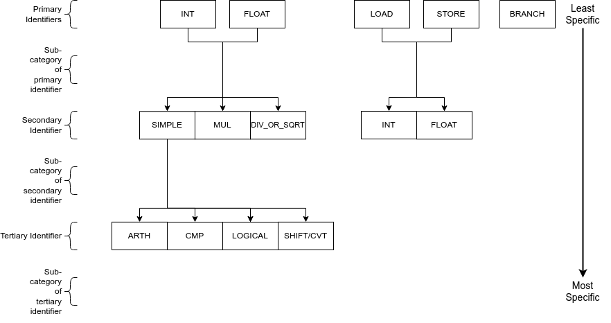

RISCV
=======

SimEng provides an almost complete implementation of the rv64imafd architecture, as well as being capable of handling some supervisor call (syscall) exceptions via basic system call emulation. This is sufficient to run many simple single threaded programs that have been statically compiled with the standard library.

.. contents:: Contents

Decoding
--------

Instruction decoding is performed using the `Capstone <https://github.com/aquynh/capstone/>`_ disassembly framework. The disassembly generated by Capstone is used to determine the properties, operands, and execution behaviour of the corresponding instruction.

The logic held in ``src/lib/arch/riscv/Instruction_decode.cc`` is primarily associated with converting the provided Capstone instruction metadata into the appropriate SimEng ``instruction`` format. Additionally, an instruction's identifiers are defined here through operand usage and opcode values. For the RISC-V architecture model, the following identifiers are defined:

- ``isStore_``, is a store operation.
- ``isLoad_``, is a load operation.
- ``isBranch_``, is a branch operation.
- ``isMultiply_``, is a multiply operation.
- ``isDivide_``, is a divide operation.
- ``isShift_``, is a shift operation.
- ``isAtomic_``, is an atomic operation.
- ``isLogical_``, is a logical operation e.g bitwise and.
- ``isCompare_``, is a compare operation.
- ``isFloat_``, is a floating point operation.
- ``isConvert_``, is a floating point to integer conversion operation.

.. _riscv-instruction-groups:

Instruction Groups
******************
Through a combination of the above identifiers, an instruction can be allocated an :ref:`instruction group <instruction-group>`. The instruction groups available to the RISC-V ISA are detailed below:

The above diagram follows the same structure as :ref:`AArch64 instruction groups <aarch64-instruction-groups>`. Each level of the diagram represents a different scope of instructions supported, the primary/top-level encapsulates the most instructions whilst the tertiary/bottom-level the least. Each of the above levels is combined through the ``_`` character, working from the top level of the diagram to the bottom. Lower levels are not required if a larger set of instructions is desired. For example the instruction group ``INT`` is valid and would encapsulate all instructions that perform integer operations, while ``INT_MUL`` is also valid but would only encapsulate the 5 multiply instructions.

This hierarchy-based naming convention has been chosen to provide the user with greater control over the number of instructions grouped under one name, whilst also remaining intuitive. A variety of combinations/instruction scopes can be defined through this method and only uses a small set of easily interpreted operation descriptions.

        .. Note::
                INT_SIMPLE_CVT and FLOAT_SIMPLE_SHIFT are both invalid instruction groups

If the supplied instruction groups don't provide a small enough scope, a Capstone opcode can be used instead (found in ``SimEng/build/_deps/capstone-lib-src/arch/RISCV/RISCVGenInstrInfo.inc``) with the format ``~{CAPSTONE_OPCODE}``.

.. _riscv-adding-instructions:

Adding instructions
-------------------

One major advantage of RISC-V over other architectures is the comparatively small number of instructions. For this reason it has been possible to implement all instructions within each supported extension rather than just those that are needed.

As the currently ratified extensions are relatively small it is recommended that a full extension is implemented at once, rather than just the instructions necessary to run a particular code. It is not expected that this will be much more work than implementing just the instructions needed and should prevent more work later in development.

Adding execution behaviour
**************************

The process for adding a new instruction is very similar to that of :ref:`AArch64 <aarch64-adding-instructions>`, by adding a new, uniquely identified entry to ``src/lib/arch/riscv/Instruction_execute.cc``.

Zero registers
**************

RISC-V provides a zero register ``RO`` which is always read as 0. This implementation mirrors that behaviour, and will automatically populate the relevant ``operands`` entry with a 0-value ``RegisterValue``.

For instructions that write to the zero registers, the result is discarded. The number of available ``results`` entries is reduced accordingly.

Loads and stores
****************

In addition to an execution behaviour, memory instructions also require a new entry in the address generation behaviour table found in ``src/lib/arch/riscv/Instruction_address.cc``. These entries are responsible for describing the method used to generate the addresses that these instructions will read from or write to.

Address generation is expected to generate one or more instances of ``MemoryAddressTarget``, containing an address and the number of bytes to access. The same variables as described in the :ref:`AArch64 documentation <aarch64-adding-execution-behaviour-operands>` (``operands``, ``metadata``) are available to use to generate these addresses.

Once the addresses have been generated, they should be supplied in a vector to the ``setMemoryAddresses`` helper function.

Pseudoinstructions
******************

Similar to AArch64 instruction aliases, RISC-V has many pseudoinstructions. These are usually specific instances of a more general instruction. They will have the same opcode but a different mnemonic. Capstone will disassemble these instructions giving a valid opcode but will often miss vital operands that need to be inferred from the instruction mnemonic. This can be quite dangerous as the instruction may pass through the pipeline completely unhindered, but will give an incorrect result. These sorts of errors are very hard to track down.

An example of this would be the pseudoinstruction ``not rd, rs``. This is implemented using the more specific instance ``xori rd, rs, -1``. Capstone will disassemble this giving the opcode for ``xori`` as well as the register codes for ``rd`` and ``rs`` but not the immediate ``-1``.

This must be fixed in the ``InstructionMetadata`` constructor. A new entry should be added to the switch statement and the pseudoinstruction mnemonic checked. The correct set of operands can then be set. A couple of helper functions are used for common operand fixes.

To ensure all pseudoinstructions are accounted for, the table in chapter 25 of the `RISC-V Unprivileged specification <https://riscv.org/technical/specifications/>`_ should be checked. It is recommended to implement all pseudoinstructions for all currently implemented instructions.

Rounding Modes
**************

RISC-V floating point instructions can use either static or dynamic rounding modes. The former embedded as 3 bits within the instruction encoding, and the later held as 3 bits of the ``fcsr`` system register.

To enforce static rounding modes, the function ``setStaticRoundingModeThen`` is used. This takes the execution logic of the instruction as a parameter in the form of a lambda function. ``setStaticRoundingModeThen`` extracts the rounding mode from the raw instruction encoding as Capstone currently doesn't perform this functionality. It then changes the C++ ``fenv`` rounding mode before calling the lambda to perform the execution logic within this new environment. Before returning execution to the switch statement, it reverts the ``fenv`` rounding mode to its initial state to preserve the dynamic rounding mode.

Updating the dynamic rounding mode can only be performed by a change to the ``fcsr`` system register. This is done using a Zicsr instruction and must happen atomically. To enforce this functionality, the relevant instruction causes a non-fatal exception. This forces all instructions earlier in program order to be committed and all instructions later to be flushed from the pipeline. This allows the ``fenv`` rounding mode to be changed while the pipeline is sterile, thus preventing incorrect rounding of speculatively executed instructions.

Zicsr
*****

The Zicsr extension is required by the F and D extensions; however, this is left with dummy implementations for this release (0.9.6). Therefore, the ``fcsr`` register is not updated based on the result of operations or the changing of the rounding mode. Thus far, this has not affected our ability to run typical high performance computing applications and miniapps.
