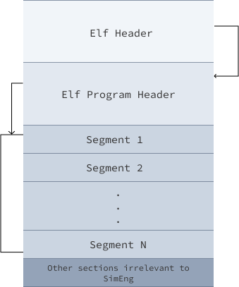

Operating System
================

The Operating System used in SimEng is an emulation of a light-weight Linux Kernel, called SimOS. SimOS does not seek to provide the full functionality of a Linux Kernel. Instead, it provides the functionality for scheduling processes to available cores, the creation of processes, and aids the emulation of system calls by maintaining process states.

Context Switching & Scheduling
-------------------------------
Within the ``tick()`` function of SimOS lies the logic for scheduling Processes to cores. The algorithm implemented is a simple Round-Robin approach where each process gets the same number of cycles per core time slice.

To schedule a new Process, SimOS will send an interupt signal to an available core which begins the process of getting the core into a switchable state. Once the core is idle, the old Core-Context can be saved to the previous process, and the new process can be scheduled onto the core; beginning execution again. Two queues are utilised within the scheduling logic in order to ensure that a single process does not cause multiple interupts to be send to multiple cores. Before triggering an interupt, a process is held in a ``waiting`` queue; and once an interupt has been signaled for a process it is moved into a ``scheduled`` queue. Only processes in the ``waiting`` queue can cause an interupt, and only processes in the ``scheduled`` queue can be scheduled onto an idle core.

Process
------------

The ``Process`` class provides the functionality to process the supplied program. It creates the Executable and Linkable Format (ELF) process image and initialises a heap and stack region. This is then sent to the memory, creating the process memory space, which contains all the data required by the program to run.

ELF Parsing
~~~~~~~~~~~~
The ELF binaries have a defined structure for 32-bit and 64-bit architectures, all information regarding parsing ELF binaries has been referenced from the `Linux manual page <https://man7.org/linux/man-pages/man5/elf.5.html>`_. The ELF binary is divided into multiple parts. SimEng stores all relevant parts of the `ELF Binary` in a ``char[] processImage`` array, which is a private member variable of the ``Process`` class.

* The `ELF Header` is the first part of `ELF binary`. The `ELF Header` holds information regarding the structure of the `ELF Binary`. SimEng extracts the following from the `ELF Header`:

    * The entry point of binary i.e. the virtual address to which the system first transfers control.
    * The file offset of the `ELF Program Headers`.
    * The size of each entry stored in the `ELF Program Header`.
* The `ELF Program Header` table is an array of structures, each describing a segment or other information the system needs to prepare the program for execution. An object file segment contains one or more sections, each section holds program and control information. SimEng extracts the following from the `ELF Program Headers`:

    * The offset from the beginning of the file at which the first byte of the segment resides.
    * The number of bytes in the memory image of the segment.
* SimEng uses these extracted values to loop through all `ELF Program Headers` and looks for the `ELF Program Header` located at largest virtual address range. SimEng uses the largest virtual address and size associated with that `ELF Program Header` to create an array called the ``ElfProcessImage``. Internally, SimEng treats these virtual address as physical addresses to index into said array.

* The segment referenced by an ELF Program Header has a type attribute which explains its contents and how to interpret it. SimEng, only extracts segments of type ``LOAD`` which specifies a loadable segment. Loadable segments most notably contain the workloads' compiled instructions and initialised data that contributes to the program's memory space. This completes the creation of the ``ElfProcessImage``.

* After the ``ElfProcessImage`` has been created the ``Process`` class creates an array ``char[] processImage``. The size of ``processImage`` is much larger than ``ElfProcessImage`` as SimEng adds the ``HEAP_SIZE`` and ``STACK_SIZE`` values specified in the YAML configuration file to the 32-byte aligned value of ``ElfProcessImage`` size. After this, SimEng proceeds to create a process stack around ``processImage``.

* The population of the initial stack state is based on the information `here <https://www.win.tue.nl/~aeb/linux/hh/stack-layout.html>`_. 

Currently, the only environment variable set is ``OMP_NUM_THREADS=1``, however, functionality to add more is available.

For the supplied program, the ``Process`` class supports both statically compiled binaries and raw instructions in a hexadecimal format.

SyscallHandler
-----

The ``SyscallHandler`` class provides part of the functionality used to emulate system calls by maintaining the process states. These states contain information about the ``Process`` class created from the supplied program. Such information includes:

- TID (or PID) and TGID
- Start location for brk system calls
- Current location of the most recent brk system call
- The initial stack pointer
- ``fileDescriptorTable`` that tracks the open file descriptors

All system call functionality is invoked within the ``SyscallHandler`` class, and any return value associated with the system call is generated here.
