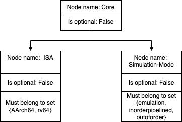

Models
========

SimEng provides a number of default processor core models, which simulate the structure and behaviour of common processor archetypes.

.. _archetypes:

Archetypes
----------

Emulation
*********

The emulation model is the simplest default model, simulating a simple atomic "emulation-style" approach to processing the instruction stream: each instruction is processed in its entirety before proceeding to the next instruction. This model is not particularly well suited for modelling all but the simplest processors, but due to its simplicity is extremely fast, and thus suitable for rapidly testing program correctness.

In future, this model may be suitable for rapidly progressing a program to a region of interest, before hot-swapping to a slower but more detailed model.

In-Order
********

The in-order model simulates a simple in-order pipelined processor core, with discrete fetch, decode, execute, and writeback stages. This model is capable of speculatively fetching instructions via a supplied branch prediction model, with a flush mechanism for mispredictions.

.. Note:: Due to a lack of dependency handling, this model only supports single-cycle instructions, which necessitates a zero-cycle memory model. Attempting to use this model with a multi-cycle memory model will result in incorrect execution and undefined behaviour.

Out-of-order
************

The out-of-order model simulates a complex superscalar out-of-order core, similar to those found in modern high-performance processors. This core contains the following pipeline stages:

- Fetch
- Decode
- Rename
- Dispatch/Issue
- Execute
- Writeback
- Commit

To facilitate out-of-order execution, this model contains the following features:

- A reorder buffer for holding in-flight instructions
- A set of reservation stations for dependency management and instruction scheduling
- A load/store queue to enable out-of-order memory access while ensuring memory order correctness
- A register alias table to allow register renaming and false dependency elimination

This model also supports speculative execution, using a supplied branch prediction model, and is capable of selectively flushing only mispredicted instructions from the pipeline while leaving correct instructions in place.

Current Hardware Models
-----------------------

Through SimEng's configurable options, the above archetypes can be transformed into models based on existing processors. More information on the configurable options of SimEng can be found :ref:`here <cnfSimEng>`.

The current existing processors have supplied configuration files:

- `ThunderX2 <https://en.wikichip.org/wiki/cavium/microarchitectures/vulcan>`_
- `A64FX <https://github.com/fujitsu/A64FX/blob/master/doc/A64FX_Microarchitecture_Manual_en_1.8.pdf>`_
- `M1 Firestorm <https://github.com/UoB-HPC/SimEng/blob/m1-dev/m1_docs/M1_Findings.md>`_

Adding model configuration options
----------------------------------

SimEng utilises a scheme which defines value expectations on mandatory and optional configuration options. The value expectations consist of:

- A default value to be used when creating an in-code default config file
- A boolean to describe whether the config option is mandatory or optional
- Either a set of values or an upper and lower bound which the supplied config option must conform to

The scheme is implemented through the ``ExpectationNode`` class which creates a tree structure where each node holds the above expectations. The tree structure should map one-to-one to the structure of the passed config file. For example:

With the YAML:

.. code-block:: text

    Core:
        ISA: AArch64
        Simulation-Mode: outoforder

The ``ExpectationNode`` tree structure would be:

The tree structure formed with ``ExpectationNode`` instances is constructed through the ``addChild(...)`` utility of the ``ExpectationNode`` class. Starting at a root node, ``addChild(...)`` is used to create various branches of the tree which map to the various config options as described in the above diagram. For those nodes which hold config values, either ``setValueBounds(...)`` or ``setValueSet(...)`` can be used to set the config value restrictions.

Creating a new expectation
**************************

Many examples of utilising the ``ExpectationNode`` class to set the expectation of a specific config value exist in ``src/lib/config/ModelConfig.cc``. To elaborate on these examples, below is a simplified outline of how you would create the expectations for the above diagram. As with ``src/lib/config/ModelConfig.cc``, ``expectations_`` is treated as the blank root node from which we construct the tree.

First, we create the expectation of the parent config key ``Core``. The ``addChild(...)`` utility takes a new ``ExpectationNode`` instance which is appended to the vector of children in the parent ``ExpectationNode`` instance; thus forming a new branch of the eventual tree structure. To create a new ``ExpectationNode`` instance, the ``ExpectationNode::createExpectation(...)`` utility can be used. There are two variants of the function, namely:

.. code-block:: text

        1.
            createExpectation(std::string key, bool optional = false)

Which is used for those nodes whose corresponding config option has no value (only a key and children).

.. code-block:: text

        2.
            template <typename T>
            createExpectation(T defaultValue, std::string key, bool optional = false)

Which is used for those nodes whose corresponding config option do have a value. The function is templated to support different config value types (e.g. T = string, integer, floating point, etc).

For the expectation on the parent config key ``Core``, given it holds no value, we don't need to set any value expectations. Therefore, the first ``createExpectation`` can be used.

.. code-block:: text

        expectations_.addChild(ExpectationNode::createExpectation("Core"));

With both the ``ISA`` and ``Simulation-Mode`` config options which do have values, the second  ``createExpectation`` must be used. First, we create the ``ExpectationNode`` instances for them and add them to the children of the new "Core" ``ExpectationNode`` instance. For simplicity of the example, we have set the default values of the ``ISA`` and ``Simulation-Mode`` config options to ``AArch64`` and ``emulation`` respectively.

.. code-block:: text
    
        expectations_["Core"].addChild(
            ExpectationNode::createExpectation<std::string>("AArch64", "ISA"));
    
        expectations_["Core"].addChild(
            ExpectationNode::createExpectation<std::string>("emulation",
                                                      "Simulation-Mode"));

Then we set the value restrictions as described in the above diagram:

.. code-block:: text

        expectations_["Core"]["ISA"].setValueSet(
            std::vector<std::string>{"AArch64", "rv64"});

        expectations_["Core"]["Simulation-Mode"].setValueSet(
            std::vector<std::string>{"emulation", "inorderpipelined", "outoforder"});

Wildcard nodes
**************

To reduce code duplication, the concept of mapping one set of expectations to many config values has been implemented. Denoted as a ``wildcard`` node, these nodes can be used to specify the value expectations on a config option which has multiple instances of the same value format/structure. For example, in the "Latencies" config option, many latencies can be defined as seen below:

.. code-block:: text

    Latencies:
    0:
        Instruction-Groups: 
        - INT_SIMPLE_ARTH
        - INT_SIMPLE_LOGICAL
        Execution-Latency: 2
        Execution-Throughput: 2
    1:
        Instruction-Groups: 
        - INT_SIMPLE_ARTH_NOSHIFT
        - INT_SIMPLE_LOGICAL_NOSHIFT
        Execution-Latency: 1
        Execution-Throughput: 1
    2:
        Instruction-Groups: 
        - INT_MUL
        Execution-Latency: 5
        Execution-Throughput: 1

Taking the "Execution-Latency" option as an example, rather than setting the expectation for an unknown number of occurrences, we can instead write:

.. code-block:: text

    expectations_["Latencies"].addChild(
      ExpectationNode::createExpectation<uint16_t>(0, wildcard));

    expectations_["Latencies"][wildcard].addChild(
      ExpectationNode::createExpectation<uint16_t>(1, "Execution-Latency"));
    expectations_["Latencies"][wildcard]["Execution-Latency"]
      .setValueBounds<uint16_t>(1, UINT16_MAX);

When validating all config options under the "Latencies" key, the ``wildcard`` node created will be used for each option.

Sequence Nodes
**************

Similar to the motivation behind the ``wildcard`` node usage, a value expectation can be set to be applied to all values in a YAML sequence/list/array/etc. By calling ``.setAsSequence()`` on an instance of ``ExpectationNode``, its value expectations will be applied to a YAML sequence of values. Below is an example of when you might use this.

.. code-block:: text

    Ports:
    0:
        Portname: Port 0
        Instruction-Group-Support:
        - INT_SIMPLE
        - INT_MUL
        - FP
    1:
        Portname: Port 1
        Instruction-Group-Support:
        - INT
        - FP

To apply a value expectation for all values in the "Instruction-Group-Support" options, we'd write:

.. code-block:: text

    expectations_["Ports"][wildcard].addChild(
        ExpectationNode::createExpectation<std::string>(
            "ALL", "Instruction-Group-Support", true));
            
    expectations_["Ports"][wildcard]["Instruction-Group-Support"].setValueSet(
        {vector of ISA-specific instruction groups});
    expectations_["Ports"][wildcard]["Instruction-Group-Support"].setAsSequence();

We once again use a ``wildcard`` node here as all options under the "Ports" config key are repeated an unknown number of times.

Additional options
******************

If any form of config value manipulation/verification is required, for example ensuring each reservation station port has an associated execution unit, this can be done in ``postValidation()`` within ``src/lib/config/ModelConfig.cc``.
