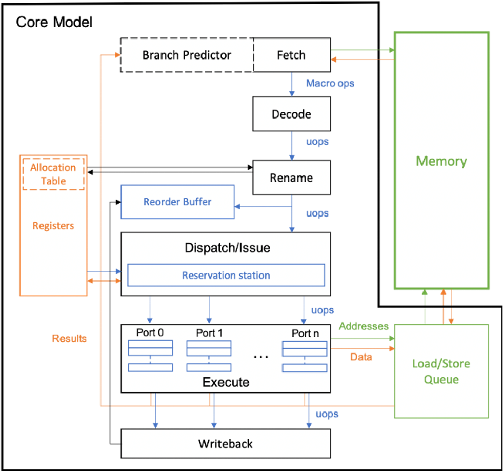

Project Overview
================

.. toctree::
   :maxdepth: 2
   :caption: Developer Documentation
   :hidden:

   developer/index
   developer/developerInfo
   developer/concepts/index
   developer/components/index
   developer/models/index
   developer/arch/index
   developer/test/index

.. toctree::
   :maxdepth: 2
   :caption: User Documentation
   :hidden:

   user/index
   user/building_simeng
   user/running_simeng
   user/configuring_simeng
   user/creating_binaries
   user/docker

The Simulation Engine (SimEng) is a framework for building modern cycle-accurate processor simulators. It aims to be:

- Fast
- Easy to use and modify to desired configurations
- Scalable, supporting simulation of simple scalar cores, up to superscalar out-of-order designs
- Capable of supporting a wide range of ISAs, starting with ARMv8 but eventually including x86, RISC-V, POWER, etc.
- Open source, with a permissive license to enable collaboration across academia and industry

SimEng places an emphasis on performance and scalability, whilst maintaining a clean, modern, and well-documented code base.

Current Support
---------------

Currently, SimEng targets the ARMv8+SVE ISA with the ability to model up to out-of-order, superscalar, single-core processors and to emulate a subset of Linux system-calls. It supports statically compiled C binaries that run on real hardware and models memory as an infinite L1 cache.

The main component provided by the simulator is a discrete processor core model, (the generic model is shown below), which accepts a clock signal and supports a memory access interface. A YAML format configuration file can be passed to the simulation to modify the core model, for instance to model other current or future core designs. Current SimEng configurations support Marvell ThunderX2 and Fujitsu A64FX processors.

As soon as SimEng is mature enough, we plan to support multi-core and memory hierarchy simulation by integrating SimEng with the `Structural Simulation Toolkit <http://sst-simulator.org/>`_ (SST). So far we have implemented a prototype of SST’s memory hierarchy integration.

Talks and presentations
-----------------------

SimEng was presented by `Professor Simon McIntosh-Smith <http://uob-hpc.github.io/SimonMS/>`_ at the 2019 Workshop on Modeling & Simulation of Systems and Applications (ModSim):

- ModSim 2019 - :download:`Enabling Processor Design Space Exploration with SimEng <assets/simeng_modsim_2019.pdf>`

Additional presentations given:

- :download:`Modelling Advanced Arm-based CPUs with SimEng <assets/simeng_arm_cpus.pdf>`

Release
-------

Currently, SimEng is still in its alpha version (1.0.0-alpha) which can be found `here<>`_. The file RELEASE_NOTES.txt, found in the root of the project, explains the status of the project at that release along with relevant information from the SimEng development team.

SimEng is release under an `Apache 2.0 <https://www.apache.org/licenses/LICENSE-2.0>`_ license.

External project usage
----------------------

- `Capstone disassembly engine <https://www.capstone-engine.org/>`_ - Instruction decoding
- `Yaml-cpp <https://github.com/jbeder/yaml-cpp>`_ - Parsing YAML configuration files
- `GoogleTest <https://github.com/google/googletest>`_ - Framework for the test suites
- `LLVM <https://github.com/llvm-mirror/llvm>`_ - Generation of binaries for use in the regression test suite

Contributors
------------

Major contributors to SimEng to date include:

Project leader

    Simon McIntosh-Smith
    
Original SimEng design and implementation:

- Hal Jones
- James Price

Current development team:

- Jack Jones (lead developer) 
- Harry Waugh

Code reviewers:

- Andrei Poenaru

Build structure design:

- Tom Lin

Internship contributions:

- Daniel Weaver
- Finn Wilkinson
- Mutalib Mohammed
- Seunghun Lee

Funding
-------

EPSRC ASiMoV project (Advanced Simulation and Modelling of Virtual systems) EP/S005072/1, Arm via a Centre of Excellence in HPC at University of Bristol

