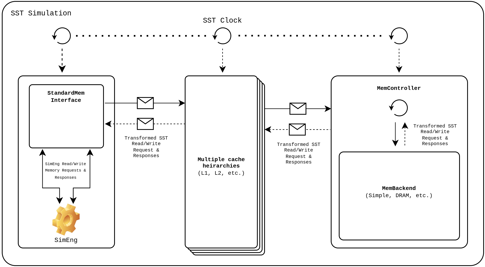

Running SimEng with SST
========================

Setup
-----
During the installation stage of SimEng with the SST integration enabled, ``libsstsimeng.so`` is installed in the 
``<path_to_simeng_install>/sst`` directory and ``libsimeng.so`` is installed in the ``<path_to_simeng_install>/lib`` directory at the install location. 
To make sure SimEng is able to run successfully inside a SST simulation, the ``$LD_LIBRARY_PATH`` environment variable should include the 
path to ``libsimeng.so`` i.e ``<path_to_simeng_install>/lib``. For the SST Simulation, SimEng also relies on components present inside **SST-Elements**, 
so the path to all **SST-Elements** needs to be included also i.e ``<sst-elements_install_directory>/lib/sst-elements-library``.

Understanding SST
-----------------
SST is used to simulate the memory hierarchy in SimEng. Since the entire simulation runs inside SST, SimEng only needs to interface with SST 
i.e send and receive memory requests. The rest is handled by SST. To make sure the desired behaviour is achieved, SST needs to be appropriately configured. 
The SST simulation is configured using a ``config.py`` python file, which contains all components and connections between them.

Main Classes
************

SST Component
'''''''''''''
SST Component is a class in SST which represents any entity that takes in a clock from SST and performs an action on every clock tick. It is the main object 
for simulation and all models inherit from SST Component. Each component inside SST has to be registered with **SST-Core.** To find information about any 
component, the ``sst-info`` command can be used to display details such as configuration options, ports, etc. The output of the ``sst-info`` command can be 
filtered using the ``--libs`` flag.

.. note::
    All SST components can be instantiated and configured via the use of a ``config.py`` file.

SST SubComponent
''''''''''''''''
SubComponent is a class loadable through the ``SST::Factory`` class which allows dynamic functionality to be added to a Component. The SubComponent API is nearly 
identical to the Component API and all the calls are forwarded to the parent Component. SubComponents are always attached to Components via slots and communicate 
with the component via the same.

SST Links
''''''''''
Links in SST are used to establish communication between two SST components. Links are attached to SST components at ports. These ports are defined for each 
Component and are documented via the registration ``MACROS`` provided by SST.

SST Memory Model
----------------

This section describes details about components that are fundamental to the SST memory model and required for configuring a SST simulation. Each of the 
components mentioned here has configuration parameters which need to be specified in order for the SimEng SST simulation to work. 

.. note::
    Some configuration parameters, ports and subcomponent slots necessary for understanding the memory model are mentioned in this section. More information about 
    configuration parameters and connecting components through ports and subcomponents slots will be provided in later sections.

SST Core
********
For the SST simulation, the actual SimEng core is instantiated in a wrapper class and registered as a custom SST component, so it can receive clock ticks from 
SST. This component is called ``SimengCore``.

StandardMem
***********
``StandardMem`` is an interface defined in SST-Core present at the namespace ``SST::Interfaces::StandardMem``. This interface acts as an entry point between the 
SimEng core and SST’s memory model. Memory requests are generated by the SimEng core in the form of class  ``SST::Interfaces::StandardMem::Request`` objects, and 
then given to the interface class via function calls. The interface class then translates the memory requests into memory event objects that are internally 
used by the memory hierarchy. When a response event is received from the SST memory model, 
the interface class finds the matching request object, generates a response object of class ``SST::Interfaces::StandardMem::Response`` and returns it to the 
SimEng core via a callback function.

StandardInterface
*****************
``StandardInterface`` is a subcomponent which implements the ``StandardMem`` interface. It is present in the ``memHierarchy`` module and needs to be configured 
before the simulation starts. ``StandardInterface`` is instantiated as a subcomponent of the SimEng core. ``SimengCore`` uses ``StandardInterface`` for 
communicating memory requests. The ``StandardInterface`` component communicates with the SimEng core using the port ``port``. The same port is used to communicate 
with the highest-level component in the memory hierarchy. Communication with memory components can also be established using the subcomponent slot ``cpulink``.
Configuration details about ``StandardInterface`` can be found using the command: ``sst-info memHierarchy.standardInterface``

Cache
*****
Because of its size and complexity, the implementation of Cache simulation in SST is divided over multiple files, however, the ``CacheController`` class is the 
main contact during simulation. The ``CacheController`` class is aliased as **Cache** in SST. Caches in SST communicate through ports ``low_network_0``  and 
``high_network_0``. The ``high_network_0`` port is used to connect to either the SimEng core (via ``StandardMem`` interface) or to higher levels of cache, 
whereas the ``low_network_0`` port is used to connect to lower levels of cache or the main memory of the SST memory model. 

The Cache component also has some subcomponent slots (``memlink`` and ``cpulink``) which can be used instead of ports to establish communication as well.

Information about different configuration parameters, ports and subcomponent slots required for simulation can be found using the command: ``sst-info memHierarchy.Cache`` 

MemoryController
****************
The ``MemoryController`` class implements the memory controller interface. The memory controller object sits between the last level cache and the memory backend 
(including the converter), and it serves as an entry point for accessing the main memory. The memory controller object is derived from the ``Component`` class, 
meaning that it can be instantiated in the configuration file, and connected to the upper-level components. All memory requests to the main memory (e.g RAM) go 
through the ``MemoryController``.

The controller object also serves as an upper-level container for other memory-related components. These related components are loaded into subcomponent slots. 
Its ``backend`` slot stores a reference to the memory backend that implements the timing of the main memory. Its ``cpulink`` slot stores a reference to the 
memory link object (either a direct link or a network-on-chip endpoint) that the controller uses to communicate with upper-level components in the memory 
hierarchy. However, instead of using the ``cpulink`` slot, the controller can also communicate with higher memory components through the ``direct_link`` port.

Information about the different configuration parameters, ports and subcomponent slots required for simulation can be found using the command: ``sst-info memHierarchy.MemController``

MemoryBackend
*************
The memory backend implements the timing model of the main memory. All memory backend implementations must inherit from the base class, ``MemBackend``, present in 
the file ``memBackend.h`` in the **SST-Elements** source code. Class ``MemBackend`` is an abstract class and hence cannot be directly instantiated. The class is 
also a child class of ``SubComponent``, and it must be loaded into the slot of the memory controller, as we have already seen earlier. SST provides a variety of 
memory backends to choose from e.g. ``simpleMem``, ``simpleDRAM``, etc (These can be specified in the configuration params for ``MemoryController``). The memory 
backend is the last level in the memory hierarchy and does not need to connect to any component further down.

Configuration for SST Simulation
--------------------------------
SST provides a python module to allow interaction with the simulation build system. SST simulations are configured through a ``config.py`` python file. The SST 
core python module is defined in CPython and is only available in the python interpreter launched within a running SST executable. SST parses the python file and 
creates a component graph, which it then uses to instantiate and configure components, links, and subcomponents.

All SST config files have to use the following import:

.. code-block:: python

    import sst 
    # or
    from sst import *

The following links can be used to access SST documentation regarding `SST Python Classes <http://sst-simulator.org/SSTPages/SSTUserPythonClasses>`_ and 
`Global Functions in SST Python Module <http://sst-simulator.org/SSTPages/SSTUserPythonGlobalFunctions>`_

Within this module, there are a number of available classes and global functions. The available classes are **Component**, **SubComponent**, **Link**, 
**StatisticOutput**, and **StatisticGroup**. The global functions are divided between general functions and functions operating on or returning one of the 
available classes mentioned.

Declaring and configuring SST Components
****************************************
Declaring components in the SST configuration files can be achieved by declaring an ``sst.Component`` class. This constructor takes in a unique identifier string 
called ``name`` and an ``element_type`` string used to identify the SST component to dynamically load during runtime. The ``element_type`` string is very 
important and has a specific format i.e ``<componentLibrary>.<(sub)componentName>``. 

.. warning::

    ``(sub)componentName`` is different from ``name``. ``(sub)componentName`` is used to locate the actual SST component or subcomponent from the SST Element 
    registry, whereas ``name`` is a just unique identifier string which can be used in the codebase to manually locate and instantiate components.

The ``componentLibrary`` string is the name of the dynamic library which contains components with the ``lib`` prefix stripped. During runtime, SST adds the 
``lib`` prefix to the ``componentLibrary`` string, dynamically loads the library, and uses the ``(sub)componentName`` string to index into the Element registry and 
instantiate the component or subcomponent.

**Example:**
SimEng core is wrapped in a class called ``SimengCoreWrapper``. The class is then registered as a custom SST component with ``(sub)componentName = simengcore``. The 
class is then compiled into a shared library with the name ``libsstsimeng``. Finally, using the ``sst-register`` executable, the ``libsstsimeng`` library and its 
path are registered into SST. This is all done automatically in the build and install steps of SST Simeng integration.

``simengcore`` can now be in a SST simulation using the following ``element_type`` string:

.. code-block:: python
    
    import sst
    cpu = sst.Component("mycore", "sstsimeng.simengcore")

Adding parameters to the SST component can be done through the ``addParams`` method of the SST Python module Component class.

.. code-block:: python

    import sst
    cpu = sst.Component("mycore", "sstsimeng.simengcore")
    cpu.addParams({
        "clock": "1GHz",
        ...
        })

.. note::

    * To find out about the ``componentLibrary`` or ``(sub)componentNane`` you can use the ``sst-info`` command.
        * The ``sst-info`` command can be used to find out about all libraries, components and subcomponents registered with the SST Core
        * The ``sst-info <componentLibrary>`` command can be used to find out about all components and subcomponents in a library.
        * The ``sst-info <componentLibrary>.<(sub)componentName>`` command can be used to get information about a specific component or subcomponent in a library.
    
    * Examples:
        * ``sst-info sstsimeng``
        * ``sst-info sstsimeng.simengcore``

Declaring and Configuring Links
*******************************
Links are present as a class in a Python SST Module as well. There are two ways to connect SST components using links. For both approaches, links first need to 
be instantiated using ``sst.Link``, which takes in a user-defined name as its argument.

Approach 1
''''''''''
For the first approach, the link needs to be instantiated and then, using the ``sst.Link.connect`` function, the components need to be connected. The connect 
function takes in 2 tuples, of the same format: ``(component, port_name, port_latency)``. ``port_name``  is the name of the port defined by the component. This 
can be found in the SST component’s documented ports with the ``sst-info`` command.

.. code-block:: python

    component_1 = sst.Component(...) # Assuming component_1 has a port called data_port
    component_2 = sst.Component(...) # Assuming component_2 has a port called data_port

    link = sst.Link("mylink") # Passing a user-defined link name

    # (component, port_name, port_latency)
    link.connect((component_1,"data_port","10ns"), (component_2,"data_port","10ns"))

Approach 2
''''''''''
For the second approach, the addLink method of each component can be used to establish communication. The addLink method takes in 3 arguments: ``link``, 
``port_name``, and ``port_latency``.

.. code-block:: python

    component_1 = sst.Component(...) # Assuming component_1 has a port called data_port
    component_2 = sst.Component(...) # Assuming component_2 has a port called data_port

    link = sst.Link("mylink") # Passing a user-defined link name

    component_1.addLink(link, "data_port", "10ns")
    component_2.addLink(link, "data_port", "10ns")

Declaring SST SubComponent
**************************
If a component has a SubComponent slot, then it can be filled using the ``component.setSubComponent`` method. This method takes in 3 arguments: ``slot_name`` , 
``element_type`` and ``slot_index``. The ``slot_index`` is the index in which the SubComponent should be inserted. This defaults to 0 and is not required if only 
one SubComponent is being loaded into the specified slot. Each SubComponent must be loaded into a unique ``slot_index`` and some SubComponents will require the 
indexes to be incremental.

.. code-block:: python

    import sst
    # Memory controller from memHierarchy library
    memctrl = sst.Component("memory", "memHierarchy.MemController")
    memctrl.addParams({
        ...
    })
    # Memory controller has a subcomponent slot for the memory backend.
    memory = memctrl.setSubComponent("backend", "memHierarchy.simpleMem")
    memory.addParams({
        ...
    })

SimEng SST Configuration
------------------------

Configuring the SimEngCore
**************************
As discussed earlier, the SimEng core has been wrapped in the ``SimengCoreWrapper`` class and registered as a custom SST Component. Instantiating and using this 
component is fundamental to running the simulation. The component has the following parameters:

* ``config_path``: Path to YAML configuration file needed by SimEng for configuration of the core microarchitecture under simulation.
* ``executable_path``: Path to the executable to run inside SimEng.
* ``executable_args``: Arguments provided to the executable.
* ``clock``: The frequency of clock ticking the SimEng Core e.g. 1GHz (S.I units accepted).
* ``max_addr_range``: maximum address which can be accessed by SimEng.
* ``cache_line_width``: Width of the cache line (in bytes).

Configuring StandardInterface
*****************************
After the ``simengcore`` has been instantiated, the ``StandardInterface`` has to be set into the ``memory`` slot of simengcore.

.. code-block:: python

   iface = cpu.setSubComponent("memory", "memHierarchy.standardInterface")

Configuring the Cache
*********************
Next, the L1 cache needs to be configured. All configuration parameters (and their documentation), ports and slots for the cache can be found using the 
command ``sst-info memHierarchy.Cache``. The default cache parameters provided by the installation are defined below:

.. code-block:: python

   l1cache = sst.Component("l1cache.mesi", "memHierarchy.Cache")
   l1cache.addParams({
        "access_latency_cycles" : "2",
        "cache_frequency" : "2Ghz",
        "replacement_policy" : "nmru",
        "coherence_protocol" : "MESI",
        "associativity" : "4",
        "cache_line_size" : "64",
        "debug" : 1,
        "debug_level" : 1,
        "L1" : "1",
        "cache_size" : "200KiB",
    })

Configuring the MemoryController and MemBackend
***********************************************

As discussed above, the ``MemoryController`` and the ``MemBackend`` are the last levels in the memory hierarchy. The ``MemBackend`` is a subcomponent of the 
``MemoryController`` (``slot: backend``) and for the SimEng simulation currently, the ``SimpleMem`` backend is used. Other backends are also supported.

All configuration parameters (and their documentation), ports, and slots for ``MemoryController`` and ``MemBackend`` can be found using the commands: ``sst-info memHierarchy.MemController``  
and ``sst-info memHierarchy.simpleMem``. The default memory controller and backend parameters provided by the installation are defined below:

.. code-block:: python

   # Memory controller
    memctrl = sst.Component("memory", "memHierarchy.MemController")
    memctrl.addParams({
        "clock" : "1GHz",
        "request_width" : "64",
        "debug" : 1,
        "debug_level" : 1,
        "addr_range_end" : 1*1024*1024*1024-1,
    })

    # Memory model
    memory = memctrl.setSubComponent("backend", "memHierarchy.simpleMem")
    memory.addParams({
        "access_time" : "1ns",
        "mem_size" : "1GiB",
    })

Connecting Components with links
********************************
In the last step, we need to connect all components defined above together so that they can communicate with each other and exchange memory requests. As mentioned 
above, the ``high_network_0`` port of the Cache needs to be connected to higher cache levels or the core. Since the SimEng core interfaces with the memory system 
through ``StandardInterface``, the cache will be connected to it. The default core to memory hierarchy component link provided by the installation are defined 
below:

.. code-block:: python
    
    cpu_to_cache_link = sst.Link("link1")
    cpu_to_cache_link.connect((iface, "port", "100ps"), (l1cache, "high_network_0", "100ps"))
    # or
    cpu_to_cache_link = sst.Link("link1")
    iface.addLink(cpu_to_cache_link, "port", "100ps")
    l1cache.addLink(cpu_to_cache_link, "high_network_0", "100ps")

Now that the SimEng core has been connected to the cache, the cache needs to connect to the lower levels of memory. For this configuration, it will be connected 
to the memory controller otherwise it will be connected to lower levels of cache i.e. L2. As mentioned earlier the cache connects to lower levels through the 
``low_network_0`` port.

.. code-block:: python

    l1_to_mem_link = sst.Link("link2")
    l1_to_mem_link.connect((l1cache, "low_netowrk_0", "50ps"), (memctrl, "direct_link", "50ps"))
    # or
    l1_to_mem_link = sst.Link("link2")
    l1cache.addLink(l1_to_mem_link, "low_network_0", "50ps")
    memctrl.addLink(l1_to_mem_link, "direct_link", "50ps")

.. warning::

    The SimEng core YAML configuration file defines ``stack_size`` and ``heap_size`` parameters which are used to determine the size of the process image. 
    In addition to these parameters, the process image size is also determined by the ELF binary header sections (which contain instructions and initialised data). To ensure 
    the simulation is very fast, SimEng internally initialises the process image as a large char array that can index the highest virtual address encountered in 
    the ELF binary header sections, eliminating the need for any address translation.

    To make sure that the memory used by SST is consistent with the details mentioned above, the memory size of the backend i.e ``mem_size`` has been set to **2GiB** 
    in the default SST ``config.py`` file. The ``SimengCoreWrapper`` checks if the SST memory backend has been configured with enough memory to store the process 
    image. This check is done using the ``addr_range_end`` parameter of ``sstsimeng.simengcore``.

    The user must also ensure that the maximum address accessible in the memory backend is consistent with ``addr_range_end`` parameter of the memory controller 
    i.e ``memHierarchy.MemController`` and ``max_addr_range`` parameter of SimEng core i.e ``sstsimeng.simengcore``.

.. note::
   More examples of the SST ``config.py`` files can be found in the **SST-Elements** code base at `this <https://github.com/sstsimulator/sst-elements/tree/master/src/sst/elements/memHierarchy/tests>`_ 
   path. Files starting with the prefix ``sdl`` contain different examples of memory hierarchy configurations which SST can simulate.

Running SST SimEng Simulation
*****************************
To run the simulation, navigate to the ``config.py`` file (the default configuration file can be found at the path ``<path-to-simeng-install>/sst/config``) and 
use the command ``sst config.py`` to start the simulation.

