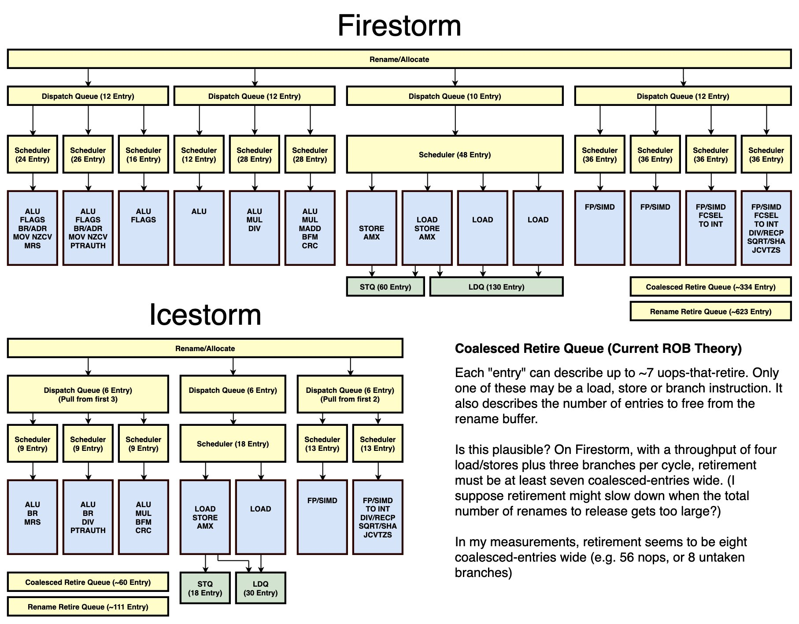

# M1 Findings

---

# TODO

Leave the 3 configs + notes in a "m1" branch. Make a PR with release config and port allocaor

## profile scripts -> simeng benchmarks branch

## Configs

### General Notes

The M1 uses a tiered front end. After rename the Firestorm core can move 8ins/cycle into the four dispatch buffers. If the buffers are empty then some instructions can be immediately executed. The DBs dispatch instructions to schedulers, each scheduler has an associated EU.

-   The dispatch buffers provide load balancing:
    -   Eg in the integer pipeline: Intructions with certain requirements, eg int mul, will be dispatched to the most optimal scheduler/execution units where possible - even though they might technically be supported by other ports
    -   Remaining instructions will be dispatched to whichever scheduler has the smallest queue.
    -   Even the specialised integer units support normal integer instructions too, so overall fullness across scheduling queues should remain balanced, with specialised instructions being scheduled more optimally
    -   The dispatch buffers are small-ish because if the schedulers and dispatch buffers get full, then once exeucution resumes it is mostly random as to which instructions are removed from the DBs first. So important instructions may get delayed. Keeping them small reduces this problem.

The schedulers are also paired. Looking at dougall's diagram shows that the instructions supported by EUs seemed to be grouped in pairs.

-   Schedulers can steal from eachothers queus to keep instructions executing
    -   Given two schedulers A,B. If A has 2 instructions ready to issue and B has none, B can take one of A's and issue it.
    -   In simeng this is a many-to-many (in m1 specifically it is 2-to-2) relationship between ports/reservation stations which is not currently supported

### Front-end Configuration Variants

I have ended up with three different M1 configurations for my M1 model. Their differences are in the configuration of ports to reservation stations. Each config field has a comment with the source of information. Fields marked with "`# !`" have no justification from my research or experiments, and are either a guess or random.

I made a port allocator which allocates instructions to the port associated with the reservation station which has the shorted queue of instructions waiting to be issued. I am reffering to this as the "Load Balancing", so entries in my results table suffixed with "LB" include this port allocator in the SimEng build.

An important diagram for understanding my different reservation station configurations is the following image by DougallJ:

### `m1_firestorm5.yaml`

In this config the ports are grouped by the dispatch queues in the diagram. So reservation staion 0 in the config is representing the first dipatch queue + its three schedulers. It has size 78 and ports to INT1, INT2 and INT3.

### `m1_firestorm6.yaml`

In this config the ports are mapped to individual schedulers. The dispatch queues are disregarded. There are 14 reservation stations each with a port to one execution unit. Note that in the diagram there is one scheduler for the load store section, this config uses 4 here. This is because the M1 explainer document disagrees with Dougall and suggests 4 schedulers here.

### `m1_firestorm7.yaml`

This configuration pairs ports in reservation stations. For example to represent the M1's integer block the config uses three reservation stations, each with two ports to EUs. The justification for this is that the M1 uses paired schedulers in the Firestorm core. The schedulers are paired, so given two schedulers A,B. If A has 2 instructions ready to issue and B has none, B can take one of A's and issue it. It makes more sense now why if you look at which instructions the EUs support in this diagram, they are roughly in sets of 2. See in the diagram how the instructions supported by the EUs seem to be in groups of two. There **is** more evidence for this explained the M1 Explainer document.

| Results |
| ------- |

| Benchmark                                   | Config          | Cycles        | % off target |
| ------------------------------------------- | --------------- | ------------- | ------------ |
| **Stream Serial gcc10.3.0 armv8.4-a**       | **M1 (target)** | **2351878**   | **NA**       |
| Stream Serial gcc10.3.0 armv8.4-a           | v5              | 3115823       | +27%         |
| Stream Serial gcc10.3.0 armv8.4-a + LB      | v5              | 5280665       | +77%         |
| Stream Serial gcc10.3.0 armv8.4-a           | v6              | 3112414       | +27%         |
| Stream Serial gcc10.3.0 armv8.4-a + LB      | v6              | 3137224       | +28%         |
| Stream Serial gcc10.3.0 armv8.4-a           | v7              | 3143975       | +28%         |
| Stream Serial gcc10.3.0 armv8.4-a + LB      | v7              | 2891630       | +20%         |
| -----------------------------------------   | --------------- | ------------- | ------------ |
| **Stream OpenMP gcc10.3.0 armv8.4-a**       | **M1 (target)** | **3380050**   | **NA**       |
| Stream OpenMP gcc10.3.0 armv8.4-a           | v5              | 6126601       | +57%         |
| Stream OpenMP gcc10.3.0 armv8.4-a + LB      | v5              | 9521638       | +95%         |
| Stream OpenMP gcc10.3.0 armv8.4-a           | v6              | 6102132       | +57%         |
| Stream OpenMP gcc10.3.0 armv8.4-a + LB      | v6              | 6102234       | +57%         |
| Stream OpenMP gcc10.3.0 armv8.4-a           | v7              | 6124035       | +58%         |
| Stream OpenMP gcc10.3.0 armv8.4-a + LB      | v7              | 6234584       | +59%         |
| --------------------------------------      | --------------- | -----------   | ------------ |
| **Tealeaf-2D Serial gcc10.3.0 armv8.4a**    | **M1 (target)** | **100927767** | **NA**       |
| Tealeaf-2D Serial gcc10.3.0 armv8.4a        | v5              | 112325132     | +11%         |
| Tealeaf-3D Serial gcc10.3.0 armv8.4a + LB   | v5              | 206773155     | +68%         |
| Tealeaf-2D Serial gcc10.3.0 armv8.4a        | v6              | 112445221     | +11%         |
| Tealeaf-2D Serial gcc10.3.0 armv8.4a + LB   | v6              | 112544326     | +11%         |
| Tealeaf-2D Serial gcc10.3.0 armv8.4a        | v7              | 112880150     | +11%         |
| Tealeaf-2D Serial gcc10.3.0 armv8.4a + LB   | v7              | 130816877     | +25%         |
| --------------------------------------      | --------------- | -----------   | ------------ |
| **Tealeaf-2D OpenMP gcc10.3.0 armv8.4a**    | **M1 (target)** | **110499653** | **NA**       |
| Tealeaf-2D OpenMP gcc10.3.0 armv8.4a        | v5              | 142734382     | +25%         |
| Tealeaf-2D OpenMP gcc10.3.0 armv8.4a + LB   | v5              | 249958887     | +77%         |
| Tealeaf-2D OpenMP gcc10.3.0 armv8.4a        | v6              | 143002056     | +25%         |
| Tealeaf-2D OpenMP gcc10.3.0 armv8.4a + LB   | v6              | 143004025     | +25%         |
| Tealeaf-2D OpenMP gcc10.3.0 armv8.4a        | v7              | 142896754     | +25%         |
| Tealeaf-2D OpenMP gcc10.3.0 armv8.4a + LB   | v7              | 164809184     | +39%         |
| --------------------------------------      | --------------- | -----------   | ------------ |
| **miniBUDE -n 64 -i 1 gcc10.3.0 armv8.4a**  | **M1 (target)** | **7140966**   | **NA**       |
| miniBUDE -n 64 -i 1 gcc10.3.0 armv8.4a      | v5              | 9051007       | +23%         |
| miniBUDE -n 64 -i 1 gcc10.3.0 armv8.4a + LB | v5              | 25180246      | +111%        |
| miniBUDE -n 64 -i 1 gcc10.3.0 armv8.4a      | v6              | 9051344       | +23%         |
| miniBUDE -n 64 -i 1 gcc10.3.0 armv8.4a + LB | v6              | 9042524       | +23%         |
| miniBUDE -n 64 -i 1 gcc10.3.0 armv8.4a      | v7              | 9115808       | +24%         |
| miniBUDE -n 64 -i 1 gcc10.3.0 armv8.4a + LB | v7              | 13071348      | +58%         |

### Profiling the M1

Profiling the M1 is not as trivial as it should be. I do not recommend using MacOS.

#### Using MacOS (Discouraged)

On MacOS, unless you have access to a GUI and Apples "Instruments" tool, the only way to access the perfomance counters on the M1 is by dynamically linking hidden kernel libraries to gain access to the KPC API. A technique for this is shown here: https://lemire.me/blog/2021/03/24/counting-cycles-and-instructions-on-the-apple-m1-processor/ . DougallJ also sent me this, which is a bit more of a general-purpose implementation of the same thing: https://gist.github.com/ibireme/173517c208c7dc333ba962c1f0d67d12 .

To run on MacOS binaries are compiled to the Mach-O format. These will not run in SimEng. To get around this do the following:

-   Write your benchmark as a function in a single C file, and compile it into Assembly with GCC's `-S` flag. This is to ensure that the assembly you execute in SimEng as well as natively on the M1 is exactly the same.
-   Link the KPC API dynamically as shown in the examples. Use C's `extern` keword to bring your function into your cycle counting script. Structure your code as follows: Start the performance counters, call your `extern` function, then stop and retreive data from the performance counters.
-   Compile and run this as a Mach-O binary to profile the M1.
-   To run in SimEng link the same assembly file, but compile as an ELF binary. Now the same assembly is compiled into both ELF and Mach-O, avoiding any divergence between the Apple compiler and normal compilers.

#### Using Asahi Linux

In Asahi Linux everything will work as an ELF binary. You can compile for a native target (see Reproducing Binaries section).

Profile in Linux using [Perf](https://man7.org/linux/man-pages/man1/perf.1.html). As of the time of writing, the Perf driver for the M1 is not very sophisticated, so perf has some querks on M1. You will only be able to access the cycle count and the instruction count. Also, unless you specify a core with the `-C` flag, perf will not count anything.

Use [taskset](https://man7.org/linux/man-pages/man1/taskset.1.html) to specify the core to run on. `lscpu` will give you info about the cores but on the M1 Mac Studio cores 0-3 are Icestorm, 4-7 are Firestorm.

`sudo taskset --cpu-list 7 perf stat --all-user -e cycles,instructions -r 10 <binary>`

will run `<binary>` 10 times on core 7 (Firestorm), counting cycles and instruction events. It will output an average for each as well as a variance. SimEng only simulates the user space, so the `--all-user` flag - or equivalent - ( eg `-e cycles:u,instructions:u`) should be included. If you do not count only the user space then your results may be inconsistent.

### Reproducing Binaries

For producing binaries that are compatible with both the M1 and SimEng there are a few additional steps. The following assumes you are using Asahi Linux. Otherwise refer to the steps for profiling on MacOS above.

To run in SimEng the binaries must be static. As of the time of writing, the version of GCC shipped with Asahi Linux does not include static versions of all libraries. This caused issues when compiling the SimEng benchmarks with the `-fopenmp` and `-static` flags together. A workaround I found was to compile my own version of GCC, specifically including static versions of all libraries. Go to https://gcc.gnu.org/install/ for instructions on this, but the main thing is to include the `--disable-shared` flag in the configuration. Running `gcc -v` will show you which configuration flags are used on your current installation of GCC. This is helpful if you want to match the configuration of your target architecture in a custom GCC install. Alternatively, you can compile the binaries on a different machine (eg Isambard), optionally using an apple cpu target with the `-march` flag. If compiling on a different machine, note that the assembly may not be optimised for M1.

### Proposals

I believe supporting the following features will improve SimEng's ability to accurately model the M1.

-   Support for pre-sorting instructions into different dispatch queues after rename - AMD also use a dispatch queue, but without sorting https://en.wikichip.org/wiki/amd/microarchitectures/zen_2#Block_Diagram
-   Support for prioritising instructions being dispatched to their most preferable RS/EU
-   Support for one-to-many relationships between ports/reservation stations
